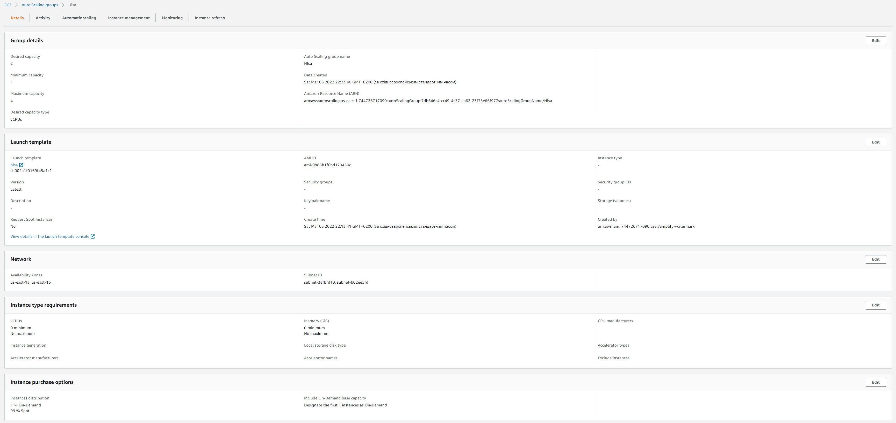
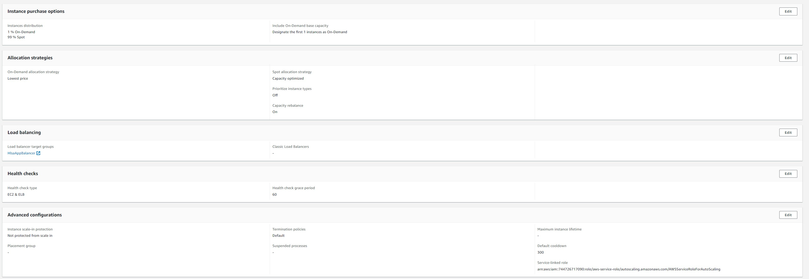
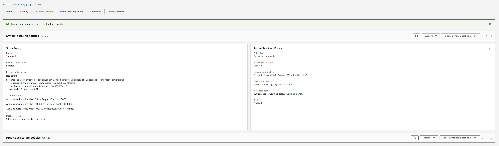

# Task Scale It!

## 

### Create autoscale group that will contain one ondemand instance and will scale on spot instances.
### Set up scaling policy based on AVG CPU usage
### Set up scaling policy based on requests amount that allows non-linear growth 

# Result

